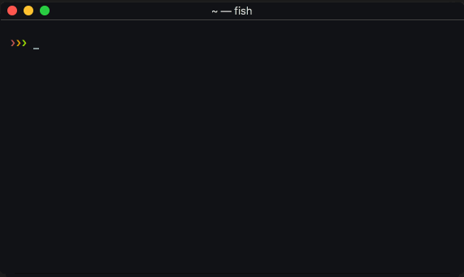
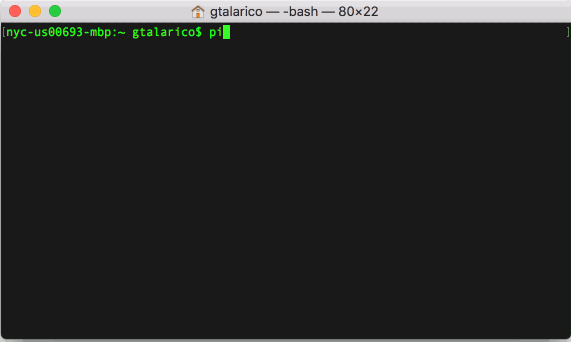

.. highlight:: console

================
Shell Completion
================

Pipes includes a helper ``--_completion`` flag which can be
used by terminals to provide autocomplete options.
Below are instructions for setting up autocompletion
for Bash, Zsh, and Fish.

If you have ideas for improving these please share them with use
over at the `Pipes repo <http://www.github.com/gtalarico/pipenv-pipes>`_

.. warning::

    Pipes cannot activate an pipenv shell when one is already active,
    thefore the autocompletion helper does not run either.
    Make sure you are not inside a Pipenv Shell when trying to use
    the autocomplete helper.

----------------------------

Fish
----

Add a new file ``pipes.fish`` to your Fish config folder
(eg. ``~/.config/fish/completions/pipes.fish``).

.. code:: console

    complete --command pipes --arguments '(pipes --_completion (commandline -cp))' --no-files

----------------------------

Bash + Zsh
-----------

Original code kindly provided by `jonatasbaldin <https://github.com/jonatasbaldin>`_
`here <https://github.com/gtalarico/pipenv-pipes/issues/10>`_

Add the code below to your `.bashrc`:

.. code:: console

    # .bashrc
    export BASE_SHELL=$(basename $SHELL)

    if [[ "$BASE_SHELL" == "zsh" ]] ; then
    autoload bashcompinit && bashcompinit
    fi

    _pipenv-pipes_completions() {
    COMPREPLY=($(compgen -W "$(pipes --_completion)" -- "${COMP_WORDS[1]}"))
    }

    complete -F _pipenv-pipes_completions pipes

