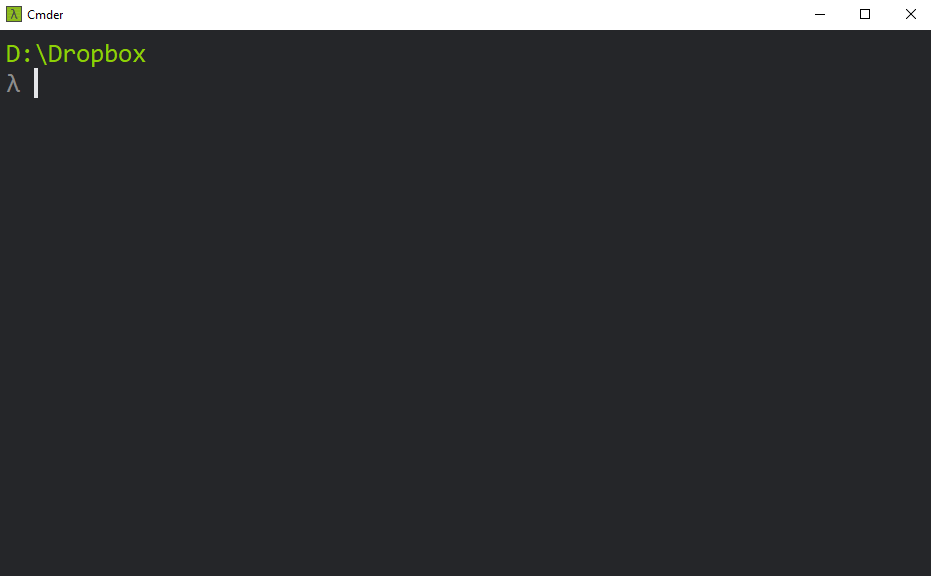

.. highlight:: shell

============
Installation
============

Compatibility
-------------

* Python 3.4+ (PRs for 2.7 welcome!)
* Unix + Windows Support 💖

Stable Release
--------------

To install Pipenv Pipes, run this command in your terminal:

MacOs + Ubuntu:

.. code-block:: console

    $ pip3 install pipenv-pipes --user

Windows:

.. code-block:: console

    $ pip3 install pipenv-pipes --find-links https://github.com/gtalarico/curses-win/releases/tag/2.2.0

This is the preferred method to install Pipenv Pipes,
as it will always install the most recent stable release.

If you don't have `pip`_ installed, this `Python installation guide`_
can guide you through the process.

.. _pip: https://pip.pypa.io
.. _Python installation guide: http://docs.python-guide.org/en/latest/starting/installation/

Known Issues
------------

``PIPENV_VENV_IN_PROJECT`` is not currently supported.
If have ideas on how Pipes could support local venvs please start an issue
and include your proposed implementation.

Curses on Windows
-----------------

The interactive selector uses Curses, which is not natively supported on windows.
To enable curses on Windows we must install additional Windows binaries,
which were obtained from `here <https://www.lfd.uci.edu/~gohlke/pythonlibs/#curses>`_

The installer should automatically install the windows curses binaries if you include the ``find-link`` as shown above.
Should you need to install them manually, 
just download the appropriate wheel from the link above and use pip to install it:

.. code-block:: console

    $ pip install ..packetPath..\curses-2.2-cpXX-none-win_XXX.whl

You can read more about windows support for curses here:
https://bugs.python.org/issue2889

Terminal
~~~~~~~~

While Pipes should work on the standard Windows console (cmd.exe)
a terminal like `Cmder`_ is highly recommended:

.. _Cmder: http://cmder.net/

