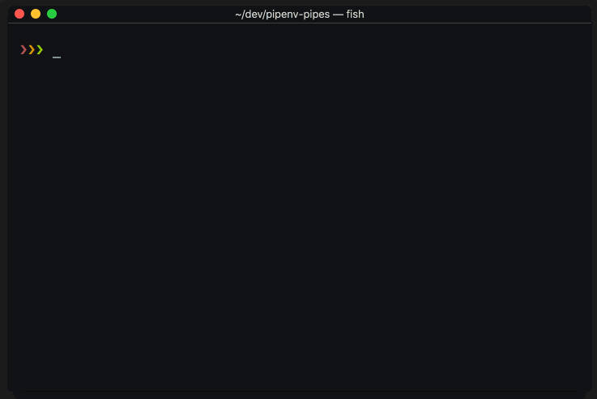

.. highlight:: console

=====
Usage
=====

Interactive Switcher
--------------------

The easiest way to use Pipes is to use the interactive switcher.

.. code:: console

  $ pipes

.. note::

  Before you can use Pipes to activate a given project, 
  the selected environment must have a project directory associated with it.
  To understand how Pipes links Project Directories with corresponding
  virtualenvs read the section on how to `Set Project Directory`_.

Keyboard Shortcuts
~~~~~~~~~~~~~~~~~~

The Interactive environment switcher accepts the following commands:

* ``UP`` + ``DOWN``: Scrolls through the list
* ``PAGE UP`` + ``PAGE DOWN``: Scrolls through the list in larger increments
* ``ENTER``: Selects and activates the environemnt
* ``ESC``: Exit Pipes
* ``LEFT`` + ``RIGHT``: Cycles through the available
  information on each virtual environment
* ``QUERY``: Use any alphanumeric characters to filter the list
* ``BACKSPACE``: Delete last character from filter term
* ``DEL``: Clear filter

From the Command Line
---------------------

You can activate an environment directly from the command line
by calling ``pipes`` followed by a query term which is used
to select the desired environment:

.. code:: console

    $ pipes project1

This would *cd* into directory ``/path/to/project1``
and activate the corresponding Pipenv Shell.

If a query term (eg. ``proj``) matches more than one project,
the `Interactive Switcher`_ will launch with the list filtered by
the entered query term.

------------------------------------------------------

List Environments
-----------------

Use Pipes to see all detected Pipenv Environments.

.. code:: console

  $ pipes --list

Output:

.. code:: bash

  project1-LwEMcb8W
  project2-R1v7_ynT

The ``--list`` flag can also be used with the ``--verbose`` option,
which shows additional information about the environments
such as the environment path, project directory (if available) and
the python version of the virtual environment.

.. code:: console

  $ pipes --list --verbose

Vebose Output:

.. code:: console

  PIPENV_HOME: /Users/user/.local/share/virtualenvs

  project1-LwEMcb8W *
      Environment: 	 $PIPENV_HOME/project1-LwEMcb8W
      Binary: 		 Python 3.5.5
      Project Dir: 	 ~/dev/project

  project2-R1v7_ynT *
      Environment: 	 $PIPENV_HOME/project2-R1v7_ynT
      Binary: 		 Python 3.4.8
      Project Dir: 	 ~/dev/project2

The presence of an asterisk (``*``) on the environment list
indicates if the virtual environment already has a project directory associated.

The `lack` of a ``*`` indicates the Environment has not yet been
associated with a project directory. If you try switching into an
environment without the ``*``, Pipes will tell you need to
*link* the environment with a project directory first.

------------------------------------------------------

Set Project Directory
---------------------

To link a project directory with its environment use the ``--link`` flag:

.. code:: console

    $ pipes --link /path/to/project1

Pipes will find the associated Pipenv Environmnet by
running ``pipenv --venv`` from from the target directory.

If the target directory finds a valid environment, Pipes will
create a new ``.project`` with the project path and save it inside
the virtual environment. This file is used by Pipes to detect the project
directory.

.. note::

  There is an open Pipenv `Pull Request`_ which would make Pipenv
  create the ``.project`` when the environment is created.
  If this PR is merged this process will become unecessary
  and the feature will be removed.

  .. _`Pull Request`: https://github.com/pypa/pipenv/pull/1861

--------------------------------------------------------

Unlink a Project
----------------

To unlink ``project1`` directory from its Pipenv Environment run:

.. code:: console

    $ pipes --unlink project1

This will delete the ``.project`` file created
by the `Set Project Directory`_ command.

----------------------------------------------------------

Usage Help
----------

You can see the list of available commands directly from
the command line:

.. code:: console

    $ pipes --help
